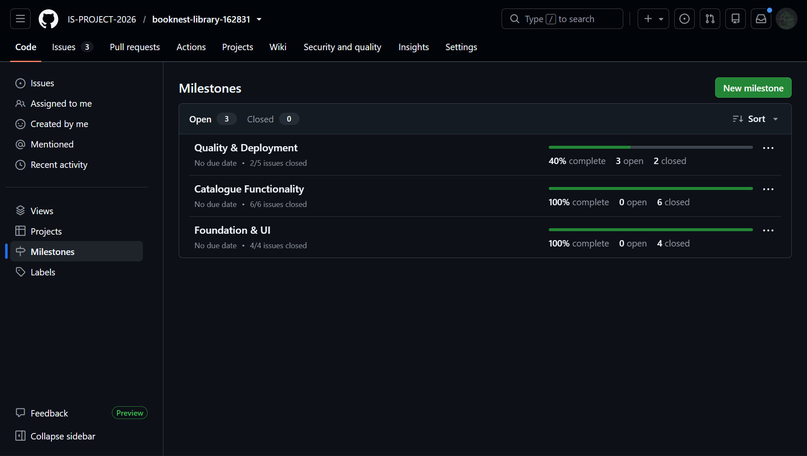
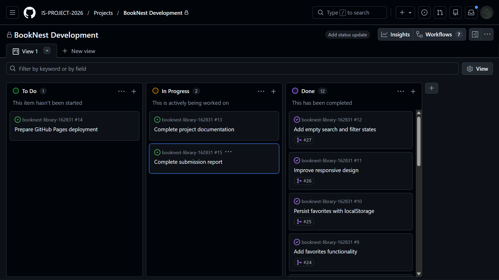
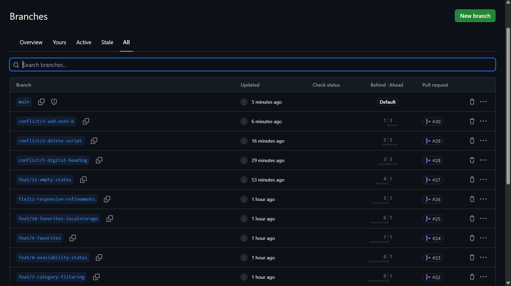
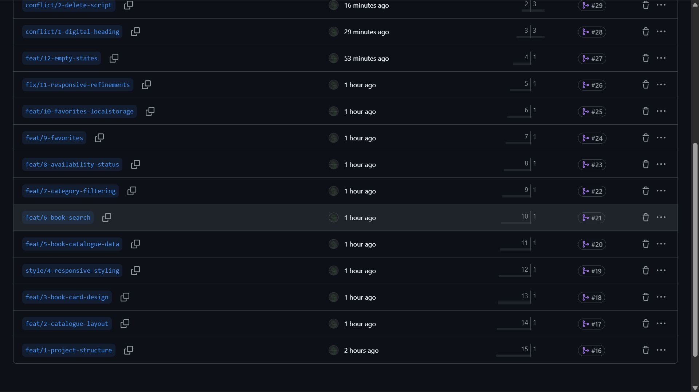
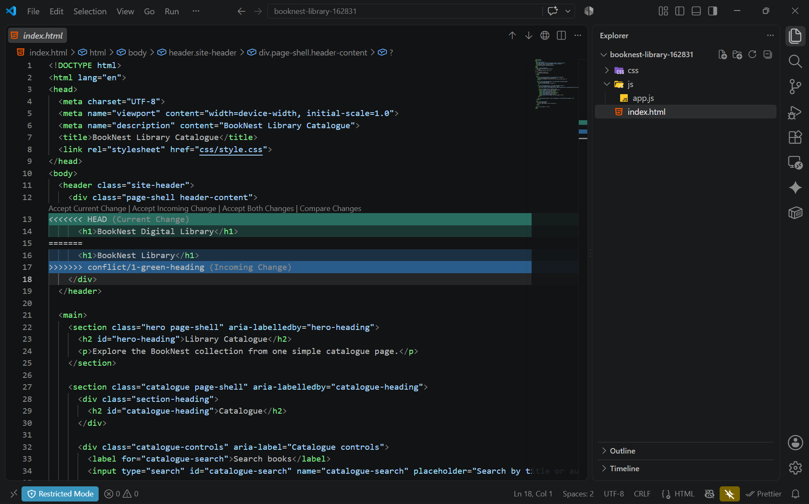
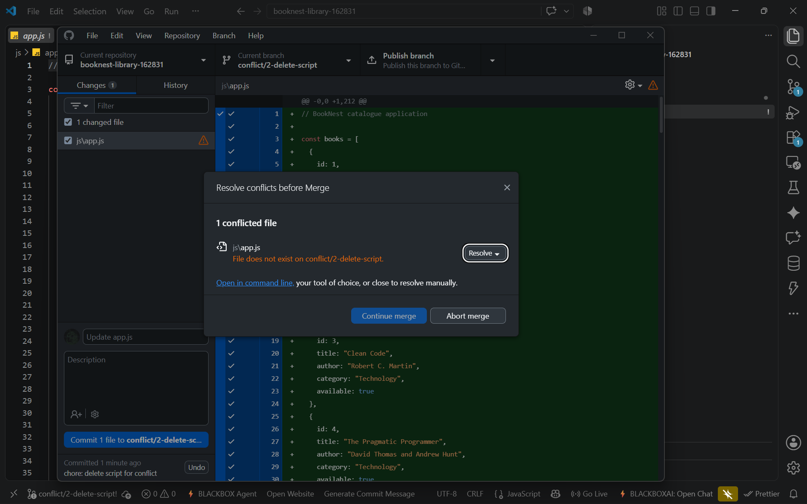
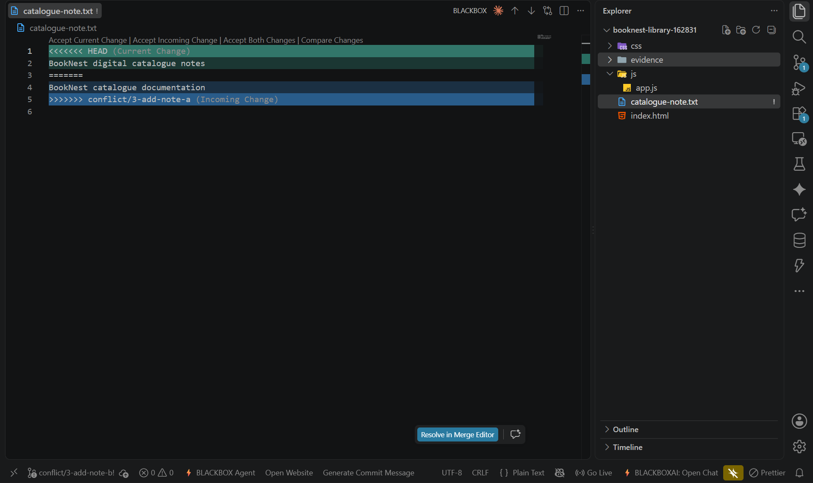

# Project Submission Report

## 1. Student Details

* **Full Name:** Wangeci Brown Kamau
* **GitHub Username:** Brown-Wangeci
* **Email:** [brown.wangeci@strathmore.edu](mailto:brown.wangeci@strathmore.edu)

## 2. Deployed Project Link

* **Live GitHub Pages URL:** [https://is-project-2026.github.io/booknest-library-162831/](https://is-project-2026.github.io/booknest-library-162831/)

## 3. Reflection — Grounded in Git History

### A. Your Best Commit

* **Commit URL:** [https://github.com/IS-PROJECT-2026/booknest-library-162831/commit/58830015e26bc9394503b5d819649d378106e72b](https://github.com/IS-PROJECT-2026/booknest-library-162831/commit/58830015e26bc9394503b5d819649d378106e72b)
* **Why this one?** This commit uses a clear Conventional Commit type and scope by implementing book search in one focused JavaScript change. It is traceable to Issue #6 and preserved the existing catalogue rendering while adding live title and author search.

### B. A Mistake or Struggle

The first merge-conflict demonstration was a useful struggle because two branches changed the same BookNest heading line differently. Git inserted conflict markers in `index.html`, and the markers were manually inspected before resolving the heading to `BookNest Library` and merging the resolution through PR #28.

* **Link to the evidence:** [https://github.com/IS-PROJECT-2026/booknest-library-162831/pull/28](https://github.com/IS-PROJECT-2026/booknest-library-162831/pull/28)

### C. A Pull Request You're Proud Of

PR #18 introduced the reusable book-card design with a focused two-file change. It stayed within Issue #3 scope, kept future features out of the branch, and was reviewed before merging.

* **PR URL:** [https://github.com/IS-PROJECT-2026/booknest-library-162831/pull/18](https://github.com/IS-PROJECT-2026/booknest-library-162831/pull/18)

### D. One Thing You Would Do Differently

* **Commit URL:** [https://github.com/IS-PROJECT-2026/booknest-library-162831/commit/94758b13ebd450083e9aa87294cf165ff5fd0e5f](https://github.com/IS-PROJECT-2026/booknest-library-162831/commit/94758b13ebd450083e9aa87294cf165ff5fd0e5f)

If starting again, I would initialize the repository with a small baseline README/main commit when creating the repository rather than starting with a completely empty remote and later creating an empty bootstrap commit manually.

## 4. Screenshots of Key GitHub Features

### A. Milestones and Issues



**Caption:** BookNest development was divided into milestones containing granular issues that were assigned before implementation began.

### B. Project Board



**Caption:** The BookNest Kanban board tracks issues through To Do, In Progress, and Done to demonstrate active project progression.

### C. Branching Architecture





**Caption:** The repository branch history demonstrates issue-linked `feat/`, `fix/`, `style/`, and conflict demonstration branches.

### D. Pull Requests & Traceability

[https://github.com/IS-PROJECT-2026/booknest-library-162831/pull/18](https://github.com/IS-PROJECT-2026/booknest-library-162831/pull/18)


**Caption:** PR #18 was linked to Issue #3 and merged the reusable book-card work through the protected main workflow.

## 5. Merge Conflict Evidence

### Conflict 1 — Full Chronology

**What cause did you use?**

Content conflict caused by two branches modifying the same line differently.

* `conflict/1-green-heading` changed the BookNest heading to `BookNest Library`.
* `conflict/1-digital-heading` changed the same heading to `BookNest Digital Library`.
* When the branches were merged, Git could not automatically choose which version should win.
* The raw conflict markers were inspected.
* The final version was manually resolved to `BookNest Library`.
* The resolved conflict history was merged through PR #28.

#### Step 1: Generating the Clash

Actual Git conflict output:

```text
CONFLICT (content): Merge conflict in index.html
Automatic merge failed; fix conflicts and then commit the result.
```

[https://github.com/IS-PROJECT-2026/booknest-library-162831/pull/28](https://github.com/IS-PROJECT-2026/booknest-library-162831/pull/28)

#### Step 2: Inside the Code Editor



**Caption:** `index.html` shows the raw conflict markers between `BookNest Digital Library` and `BookNest Library` after both branches modified the same heading line.

#### Step 3: Resolution & Clean Merge

[https://github.com/IS-PROJECT-2026/booknest-library-162831/pull/28](https://github.com/IS-PROJECT-2026/booknest-library-162831/pull/28)

**Caption:** The conflict was manually resolved to `BookNest Library`, committed, and successfully merged into main through PR #28.

---

### Conflict 2 — Different Cause

**What cause did you use?**

Modify/delete conflict.

**Why does this cause trigger a conflict?**

`conflict/2-delete-script` deleted `js/app.js`, while `conflict/2-modify-script` modified the same file. Git could not automatically determine whether the file should remain deleted or whether the modified version should be retained.

The conflict was resolved by retaining `js/app.js` so the working BookNest JavaScript functionality remained intact.



**Caption:** Git reports `js/app.js` as a modify/delete conflict because one branch deleted the file while the other modified it.

---

### Conflict 3 — Different Cause

**What cause did you use?**

Add/add conflict.

**Why does this cause trigger a conflict?**

Two branches independently created `catalogue-note.txt` with different content. Because both branches added different versions of the same new file, Git could not automatically determine which new version should be retained.

The file was manually resolved to:

`BookNest catalogue documentation`



**Caption:** `catalogue-note.txt` displays raw add/add conflict markers after both branches independently created different versions of the same file.

## 6. Feedback & Evaluation

**Anonymous Evaluation Form:** [https://forms.gle/YLybnsyXXErKEg3s9](https://forms.gle/YLybnsyXXErKEg3s9)

## Final Submission

**Repository:** [https://github.com/IS-PROJECT-2026/booknest-library-162831](https://github.com/IS-PROJECT-2026/booknest-library-162831)

**Live Site:** [https://is-project-2026.github.io/booknest-library-162831/](https://is-project-2026.github.io/booknest-library-162831/)

**Submission Form:** [https://forms.gle/KrT4VxtFtkU3wtYu8](https://forms.gle/KrT4VxtFtkU3wtYu8)
